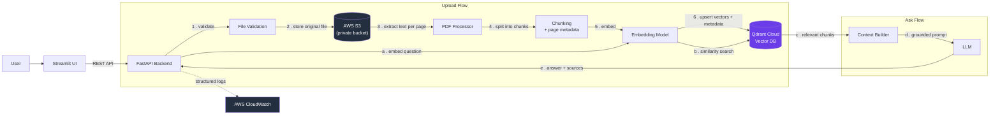
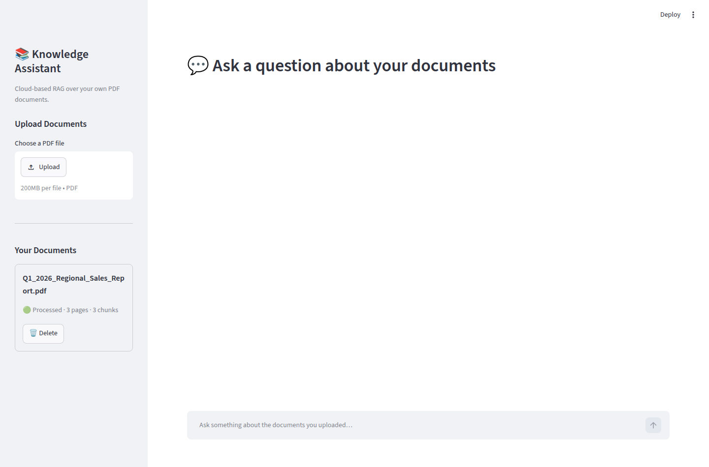
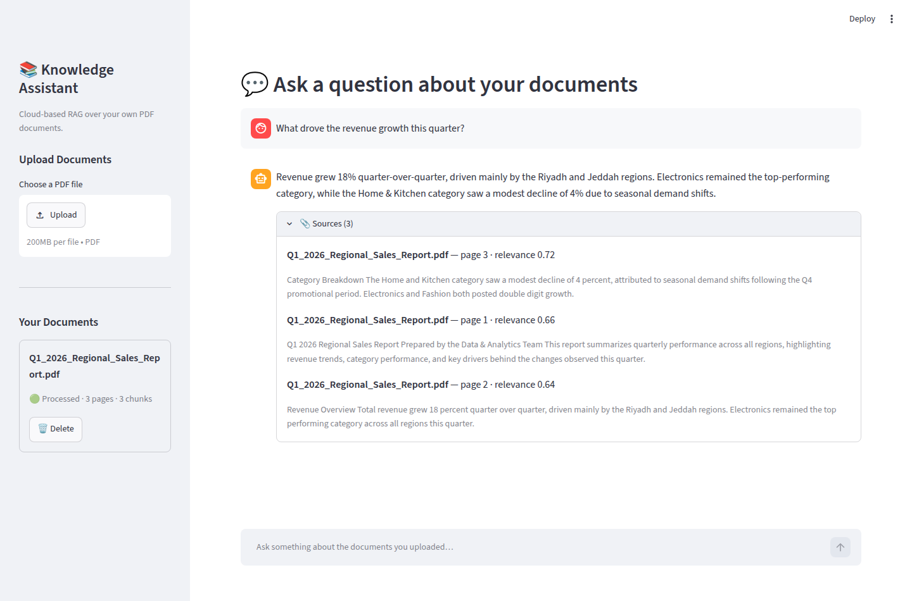

# Cloud AI Knowledge Assistant

A cloud-based **Retrieval-Augmented Generation (RAG)** system: upload PDF documents, ask
questions about them in plain language, and get answers that are grounded in your own
files — with the exact document and page number cited for every claim.

Built as a portfolio project to demonstrate end-to-end **AI Engineering + Data + Cloud +
Backend** skills: a real multi-stage RAG pipeline (not "paste the whole PDF into the
prompt"), private cloud storage on AWS S3, a managed vector database (Qdrant Cloud),
a documented REST API, a usable UI, containerized deployment, tests, and monitoring.

## Project Overview

1. A user uploads one or more PDF files through a Streamlit UI (or directly via the API).
2. Each file is validated, stored privately in AWS S3, and processed: text is extracted
   page by page, split into overlapping chunks, embedded, and indexed in Qdrant Cloud
   together with metadata (document, page number, chunk id, upload date).
3. The user then asks a question. The question is embedded and used to run a semantic
   similarity search in Qdrant, retrieving only the most relevant chunks.
4. Those chunks are passed as context to an LLM, which is instructed to answer **only**
   from that context — and to say so plainly when the documents don't contain the answer,
   rather than inventing one.
5. The answer is returned together with its sources: file name, page number, and a
   relevance score for every chunk that was used.

```
User → Web Interface (Streamlit) → FastAPI → AWS S3 → PDF Processing → Text Extraction
→ Chunking → Embeddings → Qdrant Cloud → Semantic Retrieval → LLM → Answer + Sources
```

## Features

- Upload PDF documents through a simple web interface, with file type and size validation
- Files are stored privately in AWS S3 (no public access, server-side encryption)
- Page-aware text extraction, so every answer can cite an exact page number
- Configurable chunking (`CHUNK_SIZE` / `CHUNK_OVERLAP`) with metadata preserved per chunk
- Embeddings generated per chunk and indexed in Qdrant Cloud alongside their metadata
- A genuine multi-stage RAG pipeline: query embedding → similarity search → grounded
  generation — never "stuff the whole document into the prompt"
- Answers include their sources (document name, page number, chunk relevance score)
- Gracefully handles the "no relevant information found" case instead of hallucinating
- Supports multiple documents at once, with per-document status tracking
  (`uploaded → processing → processed / failed`)
- List, inspect, and delete uploaded documents (deletion cleans up S3, Qdrant, and the
  local registry together)
- Centralized error handling with typed exceptions and consistent JSON error responses
- Structured logging, with optional AWS CloudWatch log shipping for production monitoring
- Fully containerized with Docker and Docker Compose (backend + frontend)
- Automated tests covering upload, validation, processing, retrieval, and the ask endpoint

## Architecture



Retrieval, in detail:

```
Question → Query Embedding → Qdrant Similarity Search → Relevant Chunks (score-filtered)
→ Context Assembly (document + page cited per chunk) → LLM → Grounded Answer + Sources
```

If no chunk clears the configured similarity threshold, the pipeline returns an explicit
"not found in the uploaded documents" answer instead of calling the LLM with weak or
irrelevant context.

## Technologies

| Layer | Technology |
|---|---|
| Language | Python 3.11 |
| API | FastAPI, Pydantic v2, Uvicorn |
| UI | Streamlit |
| Object storage | AWS S3 |
| Access control | AWS IAM (least-privilege, no public bucket access) |
| Monitoring | AWS CloudWatch Logs |
| Vector database | Qdrant Cloud |
| Orchestration | LangChain (text splitting) |
| Embeddings | OpenAI `text-embedding-3-small` |
| LLM | OpenAI `gpt-4o-mini` (default) or Anthropic Claude — switchable via `LLM_PROVIDER` |
| PDF parsing | pypdf |
| Containerization | Docker, Docker Compose |
| Testing | pytest, httpx, FastAPI `TestClient` |

## Project Structure

```
cloud-ai-knowledge-assistant/
├── backend/
│   ├── app/
│   │   ├── main.py               FastAPI app + routes
│   │   ├── config.py             Environment-driven settings (pydantic-settings)
│   │   ├── dependencies.py       FastAPI dependency providers (for DI + testing)
│   │   ├── schemas.py            Pydantic request/response models
│   │   ├── exceptions.py         Typed app errors + centralized error handlers
│   │   ├── logging_config.py     Console + optional CloudWatch logging
│   │   ├── s3_client.py          AWS S3 upload / download / delete
│   │   ├── pdf_processor.py      Page-by-page text extraction
│   │   ├── chunking.py           Text splitting with page/document metadata
│   │   ├── embeddings.py         OpenAI embedding generation
│   │   ├── vector_store.py       Qdrant Cloud collection, upsert, search, delete
│   │   ├── llm_client.py         Grounded-answer generation (OpenAI or Anthropic)
│   │   ├── rag_pipeline.py       Retrieval + generation orchestration
│   │   ├── document_service.py   Upload/processing/deletion orchestration
│   │   └── document_registry.py  Local JSON-backed document status registry
│   ├── tests/                    pytest suite (upload, validation, processing,
│   │                             retrieval, ask, error cases) - all external
│   │                             services (S3/Qdrant/LLM) are faked, no real
│   │                             credentials or network calls needed to test
│   ├── requirements.txt
│   ├── Dockerfile
│   └── pytest.ini
├── frontend/
│   ├── streamlit_app.py          Upload, document list, chat/ask UI
│   ├── requirements.txt
│   └── Dockerfile
├── screenshots/                  UI screenshots (see Screenshots section)
├── docker-compose.yml
├── .env.example
├── .gitignore
└── README.md
```

## Setup

### Prerequisites

- Python 3.11+
- Docker and Docker Compose (recommended, for the easiest run)
- An AWS account with permission to create an S3 bucket and an IAM user
- A free [Qdrant Cloud](https://cloud.qdrant.io) cluster
- An OpenAI API key (for embeddings, and for the LLM if `LLM_PROVIDER=openai`) and/or an
  Anthropic API key (if `LLM_PROVIDER=anthropic`)

### 1. Clone and configure environment variables

```bash
git clone https://github.com/Lamya-Alabdullatif/cloud-ai-knowledge-assistant.git
cd cloud-ai-knowledge-assistant
cp .env.example .env
```

Open `.env` and fill in the placeholders described below. **Never commit `.env`** — it is
already excluded via `.gitignore`.

## Environment Variables

All configuration lives in `.env` (see `.env.example` for the authoritative list with
comments). The important ones:

| Variable | Description |
|---|---|
| `AWS_ACCESS_KEY_ID` / `AWS_SECRET_ACCESS_KEY` | Credentials for a scoped IAM user (see AWS Setup) |
| `AWS_REGION` | AWS region of your S3 bucket, e.g. `us-east-1` |
| `S3_BUCKET_NAME` | Name of the private S3 bucket used for document storage |
| `CLOUDWATCH_ENABLED` | `true` to ship logs to CloudWatch, `false` to log to console only |
| `CLOUDWATCH_LOG_GROUP` / `CLOUDWATCH_LOG_STREAM` | CloudWatch destination for logs |
| `QDRANT_URL` / `QDRANT_API_KEY` | Your Qdrant Cloud cluster endpoint + API key |
| `QDRANT_COLLECTION_NAME` | Name of the Qdrant collection to use/create |
| `OPENAI_API_KEY` | Used for embeddings, and for the LLM when `LLM_PROVIDER=openai` |
| `LLM_PROVIDER` | `openai` or `anthropic` |
| `ANTHROPIC_API_KEY` | Used for the LLM when `LLM_PROVIDER=anthropic` |
| `CHUNK_SIZE` / `CHUNK_OVERLAP` | Text chunking parameters (characters) |
| `TOP_K_RESULTS` | How many chunks to retrieve per question |
| `SIMILARITY_SCORE_THRESHOLD` | Minimum similarity score to trust a retrieved chunk |
| `MAX_FILE_SIZE_MB` | Maximum accepted PDF size |
| `API_BASE_URL` | Used by the Streamlit frontend to reach the backend |

## AWS Setup

1. **Create a private S3 bucket** (e.g. `your-name-knowledge-assistant`):
   - Region of your choice, matching `AWS_REGION`.
   - Leave **"Block all public access" enabled** — this project never needs a public
     bucket; files are always read back through the backend using your credentials.
2. **Create a least-privilege IAM user** (never use root account keys):
   - IAM → Users → Create user → Programmatic access (Access key).
   - Attach an inline policy scoped to only this bucket, for example:
     ```json
     {
       "Version": "2012-10-17",
       "Statement": [
         {
           "Effect": "Allow",
           "Action": ["s3:PutObject", "s3:GetObject", "s3:DeleteObject"],
           "Resource": "arn:aws:s3:::your-bucket-name/*"
         },
         {
           "Effect": "Allow",
           "Action": ["s3:ListBucket"],
           "Resource": "arn:aws:s3:::your-bucket-name"
         }
       ]
     }
     ```
   - Copy the generated Access Key ID / Secret Access Key into `.env`.
3. **(Optional) Enable CloudWatch monitoring**:
   - Add `"logs:CreateLogGroup", "logs:CreateLogStream", "logs:PutLogEvents"` to the same
     IAM policy (scoped to your log group ARN), then set `CLOUDWATCH_ENABLED=true`.
   - The backend will create the log group/stream automatically on first write.

## Qdrant Setup

1. Sign up at [cloud.qdrant.io](https://cloud.qdrant.io) and create a free cluster.
2. From the cluster dashboard, copy the **Cluster URL** into `QDRANT_URL` and generate an
   **API key** into `QDRANT_API_KEY`.
3. Leave `QDRANT_COLLECTION_NAME` as-is or rename it — the backend creates the collection
   automatically on first startup if it doesn't exist yet, sized to match
   `EMBEDDING_DIMENSIONS`.

## How to Run

### Option A — Docker Compose (recommended)

```bash
docker compose up --build
```

- Backend API: http://localhost:8000 (docs at http://localhost:8000/docs)
- Streamlit UI: http://localhost:8501

### Option B — Run locally without Docker

**Backend:**

```bash
cd backend
python3 -m venv venv
source venv/bin/activate        # Windows: venv\Scripts\activate
pip install -r requirements.txt
uvicorn app.main:app --reload --host 0.0.0.0 --port 8000
```

**Frontend** (in a second terminal):

```bash
cd frontend
python3 -m venv venv
source venv/bin/activate
pip install -r requirements.txt
export API_BASE_URL=http://localhost:8000   # Windows (PowerShell): $env:API_BASE_URL="http://localhost:8000"
streamlit run streamlit_app.py
```

### Running the tests

```bash
cd backend
pip install -r requirements.txt
pytest -v
```

The test suite fakes every external service (S3, Qdrant, the embedding model, and the
LLM), so it runs fully offline — no AWS, Qdrant, or OpenAI credentials are required to
run `pytest`.

## API Documentation

Interactive OpenAPI docs are served at `/docs` once the backend is running. Summary:

| Method | Endpoint | Description |
|---|---|---|
| `POST` | `/upload` | Upload a PDF (multipart form field `file`); validates, stores in S3, extracts, chunks, embeds, and indexes it before returning |
| `GET` | `/documents` | List all tracked documents with their status |
| `GET` | `/documents/{id}` | Get one document's metadata and processing status |
| `DELETE` | `/documents/{id}` | Delete a document from S3, Qdrant, and the registry |
| `POST` | `/ask` | `{"question": "...", "document_ids": [optional], "top_k": optional}` → grounded answer + sources |
| `GET` | `/health` | Liveness/readiness probe |

**Example: ask a question**

```bash
curl -X POST http://localhost:8000/ask \
  -H "Content-Type: application/json" \
  -d '{"question": "What are the main findings in the uploaded report?"}'
```

```json
{
  "question": "What are the main findings in the uploaded report?",
  "answer": "...",
  "sources": [
    {
      "document_id": "b6c1...",
      "document_name": "report.pdf",
      "page_number": 3,
      "chunk_id": "9f2a...",
      "score": 0.81,
      "text_snippet": "..."
    }
  ],
  "grounded": true
}
```

All errors follow a consistent shape: `{"error": "<error_code>", "message": "<human readable message>"}`,
with an appropriate HTTP status code (`400` invalid input, `404` not found, `413` file too
large, `422` processing failed, `502` upstream service failure).

## Security

- No secrets are hardcoded anywhere in the codebase — everything sensitive is read from
  environment variables (`.env`, excluded from git via `.gitignore`; `.env.example` ships
  with placeholders only).
- The S3 bucket is private with all public access blocked; objects are only ever read
  back through the backend using scoped IAM credentials.
- The IAM policy attached to the app's credentials is scoped to a single bucket and the
  minimum required actions (`PutObject`/`GetObject`/`DeleteObject`/`ListBucket`).
- Uploads are validated for file extension, non-empty content, and a configurable maximum
  size before anything is written to S3.
- All API input is validated through Pydantic models; invalid requests return `4xx` with a
  clear error rather than crashing the server.
- Every code path is wrapped so unexpected exceptions return a generic `500` instead of
  leaking stack traces or internal details to the client.

## Screenshots

**Upload a document and track its processing status**



**Ask a question and get a grounded answer with cited sources**



## Future Improvements

- OCR support for scanned/image-only PDFs (currently only text-layer PDFs are supported)
- Support additional file types (`.docx`, `.txt`, `.md`)
- Swap the local JSON document registry for DynamoDB or PostgreSQL for multi-instance
  deployments
- Add authentication (per-user document isolation) and per-user rate limiting
- Streaming LLM responses in the Streamlit UI instead of waiting for the full answer
- Async/background processing for very large PDFs (return `202 Accepted` immediately,
  poll `/documents/{id}` for status) instead of processing synchronously inside `/upload`
- CI pipeline (GitHub Actions) running `pytest` and a Docker build on every push
- Deploy reference infrastructure (e.g. AWS ECS/Fargate + CloudFront) with Terraform

## License

MIT — see [LICENSE](LICENSE).
